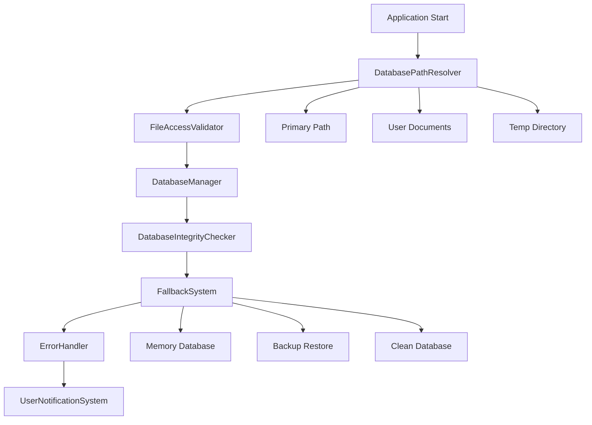

# Design Document

## Overview

Bu tasarım, TezgahTakip uygulamasında yaşanan "sqlite3.OperationalError: unable to open database file" hatalarını çözmek için güvenilir bir veritabanı erişim sistemi oluşturmayı amaçlar. Sistem, çoklu fallback mekanizmaları, proaktif hata tespiti ve kullanıcı dostu hata yönetimi ile veritabanı erişim sorunlarını minimize eder.

## Architecture

Sistem, mevcut `DatabaseManager` sınıfını genişleten ve aşağıdaki bileşenlerden oluşan modüler bir yapıya sahiptir:



## Components and Interfaces

### 1. DatabasePathResolver

Veritabanı dosyası için güvenli ve erişilebilir yollar belirler.

```python
class DatabasePathResolver:
    def resolve_database_path(self) -> str
    def get_fallback_paths(self) -> List[str]
    def validate_path_accessibility(self, path: str) -> bool
    def create_directory_if_needed(self, path: str) -> bool
```

**Yol Öncelik Sırası:**
1. Mevcut konfigürasyon dosyasındaki yol
2. Kullanıcının Belgeler klasörü/TezgahTakip
3. Uygulama dizini (yazma izni varsa)
4. Kullanıcının AppData/Local klasörü
5. Sistem geçici dizini

### 2. FileAccessValidator

Dosya ve dizin erişim izinlerini kontrol eder.

```python
class FileAccessValidator:
    def check_directory_permissions(self, path: str) -> PermissionResult
    def check_file_permissions(self, file_path: str) -> PermissionResult
    def test_write_access(self, directory: str) -> bool
    def get_permission_issues(self, path: str) -> List[str]
```

**PermissionResult Enum:**
- `FULL_ACCESS`: Okuma ve yazma izni var
- `READ_ONLY`: Sadece okuma izni var
- `NO_ACCESS`: Erişim izni yok
- `PATH_NOT_EXISTS`: Yol mevcut değil

### 3. Enhanced DatabaseManager

Mevcut `DatabaseManager` sınıfını genişletir.

```python
class EnhancedDatabaseManager(DatabaseManager):
    def __init__(self, db_path=None, enable_fallback=True)
    def init_database_with_fallback(self) -> bool
    def handle_connection_error(self, error: Exception) -> bool
    def switch_to_fallback_database(self) -> bool
    def get_database_status(self) -> DatabaseStatus
```

### 4. DatabaseIntegrityChecker

Veritabanı dosyasının bütünlüğünü kontrol eder.

```python
class DatabaseIntegrityChecker:
    def check_database_integrity(self, db_path: str) -> IntegrityResult
    def repair_database(self, db_path: str) -> bool
    def backup_corrupted_database(self, db_path: str) -> str
    def create_integrity_report(self, db_path: str) -> Dict[str, Any]
```

### 5. FallbackSystem

Ana veritabanı erişimi başarısız olduğunda alternatif çözümler sunar.

```python
class FallbackSystem:
    def create_memory_database(self) -> bool
    def restore_from_backup(self) -> Optional[str]
    def create_clean_database(self, path: str) -> bool
    def migrate_data_to_new_location(self, old_path: str, new_path: str) -> bool
```

### 6. Enhanced ErrorHandler

Veritabanı hatalarını analiz eder ve çözüm önerir.

```python
class EnhancedErrorHandler:
    def analyze_sqlite_error(self, error: Exception) -> ErrorAnalysis
    def get_solution_suggestions(self, error_type: str) -> List[str]
    def format_user_message(self, error: Exception, solutions: List[str]) -> str
    def log_error_with_context(self, error: Exception, context: Dict[str, Any])
```

## Data Models

### ErrorAnalysis

```python
@dataclass
class ErrorAnalysis:
    error_type: str
    error_code: Optional[str]
    probable_cause: str
    severity: str  # 'low', 'medium', 'high', 'critical'
    auto_fixable: bool
    suggested_actions: List[str]
    technical_details: Dict[str, Any]
```

### DatabaseStatus

```python
@dataclass
class DatabaseStatus:
    is_connected: bool
    database_path: str
    is_fallback: bool
    fallback_type: Optional[str]  # 'memory', 'backup', 'clean'
    last_error: Optional[str]
    connection_attempts: int
    integrity_status: str
```

### PermissionResult

```python
@dataclass
class PermissionResult:
    can_read: bool
    can_write: bool
    can_create: bool
    error_message: Optional[str]
    suggested_fix: Optional[str]
```

## Correctness Properties

*A property is a characteristic or behavior that should hold true across all valid executions of a system-essentially, a formal statement about what the system should do. Properties serve as the bridge between human-readable specifications and machine-verifiable correctness guarantees.*

### Property 1: Path Resolution Cascade
*For any* system configuration, when the path resolver attempts to find a database location, it should try paths in the correct priority order and always succeed in finding a usable location (even if temporary).
**Validates: Requirements 1.1, 1.2, 1.3**

### Property 2: File Access Validation Completeness
*For any* given path, the file access validator should always perform both directory and file permission checks and provide appropriate recommendations when access is insufficient.
**Validates: Requirements 2.1, 2.2, 2.3**

### Property 3: Comprehensive Logging
*For any* system operation (path resolution, permission checks, fallback operations, integrity checks), the system should create appropriate log entries with sufficient detail for debugging.
**Validates: Requirements 1.4, 2.4, 4.4, 5.4**

### Property 4: SQLite Error Analysis
*For any* sqlite3.OperationalError that occurs, the error handler should analyze the error and provide specific, actionable solutions based on the error type.
**Validates: Requirements 3.1, 3.2, 3.3**

### Property 5: User-Friendly Error Messages
*For any* error message displayed to users, it should be in Turkish and use clear, non-technical language that helps users understand the problem and solution.
**Validates: Requirements 3.4, 6.1, 6.4**

### Property 6: Fallback System Reliability
*For any* database access failure, the fallback system should attempt alternative locations in order and ultimately provide a working database (even if in-memory) while properly notifying the user.
**Validates: Requirements 4.1, 4.2, 4.3**

### Property 7: Database Integrity Enforcement
*For any* database file that is opened, the system should verify its integrity and take appropriate action (repair, restore from backup, or create new) if corruption is detected.
**Validates: Requirements 5.1, 5.2, 5.3**

### Property 8: User Communication Completeness
*For any* automatic solution applied or manual intervention required, the error handler should provide clear explanations of what happened and what the user needs to do (if anything).
**Validates: Requirements 6.2, 6.3**

## Error Handling

### Error Classification

**Critical Errors (Application Cannot Start):**
- Database file completely inaccessible
- All fallback locations failed
- Severe file system permissions issues

**Recoverable Errors (Automatic Fix Possible):**
- Database file locked by another process
- Corrupted database with available backup
- Insufficient permissions with alternative locations available

**Warning Conditions (User Notification Required):**
- Using fallback database location
- Using in-memory database (data not persistent)
- Database restored from backup (potential data loss)

### Error Recovery Strategies

1. **Immediate Retry**: For transient errors (file locks, temporary permission issues)
2. **Alternative Path**: For access denied errors on primary location
3. **Backup Restoration**: For corrupted database files
4. **Clean Database**: When no backup is available
5. **In-Memory Fallback**: When all persistent options fail

### User Notification Levels

- **Info**: Successful automatic recovery
- **Warning**: Using fallback options, potential data implications
- **Error**: Manual intervention required
- **Critical**: Application functionality severely limited

## Testing Strategy

### Unit Testing Approach

**Specific Examples and Edge Cases:**
- Test with various Windows permission scenarios
- Test with different user account types (admin vs standard)
- Test with antivirus software interference simulation
- Test with network drive scenarios
- Test with very long file paths
- Test with special characters in paths
- Test with read-only file systems

**Integration Testing:**
- Test complete error recovery workflows
- Test interaction between components during failures
- Test user notification system integration
- Test logging system integration

### Property-Based Testing Configuration

**Framework**: Use `hypothesis` library for Python property-based testing
**Test Configuration**: Minimum 100 iterations per property test
**Test Data Generation**: 
- Generate various file system states
- Generate different permission combinations
- Generate various SQLite error conditions
- Generate different system configurations

**Property Test Tags**: Each property test must include a comment with the format:
**Feature: database-access-fix, Property {number}: {property_text}**

### Test Environment Setup

**Mock File System**: Use `pyfakefs` to simulate various file system conditions
**Permission Testing**: Use platform-specific permission manipulation
**Error Injection**: Mock SQLite operations to inject specific errors
**Logging Verification**: Capture and verify log outputs for all operations

### Coverage Requirements

- **Path Resolution**: Test all priority paths and edge cases
- **Permission Validation**: Test all permission combinations
- **Error Handling**: Test all SQLite error types
- **Fallback System**: Test all fallback scenarios
- **User Notifications**: Test all message types and languages
