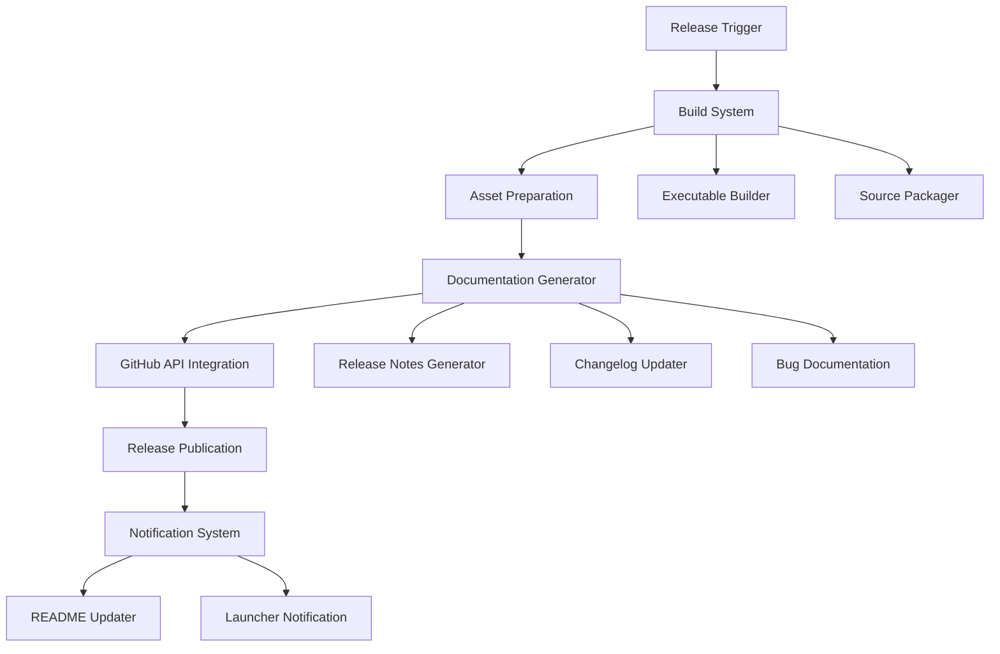

# Design Document

## Overview

TezgahTakip v2.1.4 hotfix release sistemi, kritik güncelleme uyumluluğu hatalarını çözen kapsamlı bir çözümü GitHub platformunda yayınlamak için tasarlanmıştır. Bu sistem, otomatik release oluşturma, dokümantasyon hazırlama ve kullanıcı bilgilendirme süreçlerini içerir.

## Architecture



## Components and Interfaces

### 1. Release Manager
**Sorumluluk**: Ana release sürecini koordine eder
**Arayüzler**:
- `create_release(version: str, hotfix_type: str) -> ReleaseResult`
- `validate_release_assets() -> ValidationResult`
- `publish_release() -> PublicationResult`

### 2. Build System
**Sorumluluk**: Executable ve source code paketleme
**Arayüzler**:
- `build_executable() -> ExecutablePath`
- `package_source_code() -> SourcePackagePath`
- `generate_checksums() -> ChecksumData`

### 3. Documentation Generator
**Sorumluluk**: Release notları ve dokümantasyon oluşturma
**Arayüzler**:
- `generate_release_notes(fixes: List[BugFix]) -> ReleaseNotes`
- `update_changelog(version: str, changes: List[Change]) -> ChangelogPath`
- `create_bug_documentation(fixes: List[BugFix]) -> BugDocPath`

### 4. GitHub Integration
**Sorumluluk**: GitHub API ile etkileşim
**Arayüzler**:
- `create_github_release(release_data: ReleaseData) -> GitHubRelease`
- `upload_assets(assets: List[Asset]) -> UploadResult`
- `update_repository_files(files: List[RepoFile]) -> UpdateResult`

### 5. Notification System
**Sorumluluk**: Kullanıcı bilgilendirme
**Arayüzler**:
- `update_readme(release_info: ReleaseInfo) -> UpdateResult`
- `notify_launcher(version: str) -> NotificationResult`
- `generate_user_announcement() -> AnnouncementText`

## Data Models

### ReleaseData
```python
@dataclass
class ReleaseData:
    version: str
    tag_name: str
    name: str
    body: str
    draft: bool
    prerelease: bool
    assets: List[Asset]
```

### BugFix
```python
@dataclass
class BugFix:
    id: str
    title: str
    description: str
    severity: str
    affected_versions: List[str]
    solution_summary: str
    technical_details: str
    test_results: TestResults
```

### Asset
```python
@dataclass
class Asset:
    name: str
    path: str
    content_type: str
    size: int
    checksum: str
```

## Correctness Properties

*A property is a characteristic or behavior that should hold true across all valid executions of a system-essentially, a formal statement about what the system should do. Properties serve as the bridge between human-readable specifications and machine-verifiable correctness guarantees.*

### Property Reflection

After analyzing all acceptance criteria, several properties can be consolidated to eliminate redundancy:

- Properties 1.1-1.5 (GitHub release creation) can be combined into comprehensive release validation
- Properties 2.1-2.5 (Release notes) can be combined into documentation completeness validation
- Properties 3.1-3.5 (Asset preparation) can be combined into asset integrity validation
- Properties 4.1-4.5 (Bug documentation) can be combined into documentation quality validation
- Properties 5.1-5.5 (Automation) can be combined into automation workflow validation
- Properties 6.1-6.5 (Notifications) can be combined into notification completeness validation

### Core Properties

**Property 1: Release Creation Completeness**
*For any* release version and hotfix data, creating a GitHub release should result in a complete release with correct tag, category, latest flag, detailed bug fixes, and all required assets
**Validates: Requirements 1.1, 1.2, 1.3, 1.4, 1.5**

**Property 2: Documentation Bilingual Completeness**
*For any* bug fix list and release data, generated release notes should contain Turkish and English descriptions, technical details, user impacts, before/after comparisons, step-by-step instructions, and known issues
**Validates: Requirements 2.1, 2.2, 2.3, 2.4, 2.5**

**Property 3: Asset Integrity Validation**
*For any* build process, the generated assets should include Windows executable, source code zip, validated checksums, download links, and verified accessibility
**Validates: Requirements 3.1, 3.2, 3.3, 3.4, 3.5**

**Property 4: Bug Documentation Quality**
*For any* list of resolved bugs, the generated documentation should contain separate sections per bug, detailed scenarios, solution approaches, test metrics, and troubleshooting guides
**Validates: Requirements 4.1, 4.2, 4.3, 4.4, 4.5**

**Property 5: Automation Workflow Completeness**
*For any* release automation execution, the system should prepare all files, perform builds, create GitHub releases, run validation tests, and handle rollbacks on errors
**Validates: Requirements 5.1, 5.2, 5.3, 5.4, 5.5**

**Property 6: Notification System Completeness**
*For any* release publication, the notification system should update README, changelog, launcher notifications, version warnings, and provide update links with instructions
**Validates: Requirements 6.1, 6.2, 6.3, 6.4, 6.5**

## Error Handling

### Release Creation Errors
- **GitHub API Failures**: Retry mechanism with exponential backoff
- **Asset Upload Failures**: Individual asset retry with integrity verification
- **Tag Creation Conflicts**: Automatic version increment with user notification

### Build System Errors
- **Compilation Failures**: Detailed error logging with source line references
- **Packaging Errors**: Cleanup and retry with alternative compression methods
- **Checksum Mismatches**: Rebuild with integrity verification

### Documentation Generation Errors
- **Template Processing Failures**: Fallback to basic templates with manual review flags
- **Translation Errors**: English-only fallback with translation pending markers
- **Format Validation Failures**: Auto-correction with validation warnings

## Testing Strategy

### Dual Testing Approach
The system will use both unit tests and property-based tests for comprehensive coverage:

**Unit Tests**: 
- Specific GitHub API response scenarios
- Edge cases in version parsing and tag creation
- Error conditions in asset upload and validation
- Integration points between release components

**Property-Based Tests**:
- Universal properties across all release types and versions
- Comprehensive input coverage through randomized release data
- Validation of correctness properties through automated testing

### Property Test Configuration
- Minimum 100 iterations per property test
- Each property test references its design document property
- Tag format: **Feature: github-hotfix-release, Property {number}: {property_text}**
- Tests will validate release creation, documentation quality, asset integrity, and notification completeness

### Testing Framework
- **pytest** for unit testing framework
- **hypothesis** for property-based testing
- **responses** library for GitHub API mocking
- **tempfile** for isolated build testing environments

<function_calls>
<invoke name="prework">
<parameter name="featureName">github-hotfix-release