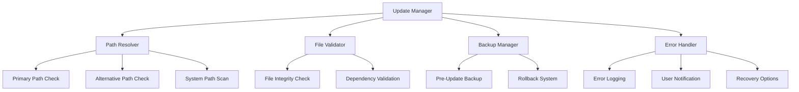

# Design Document: Update Compatibility Fix

## Overview

Bu tasarım, TezgahTakip uygulamasında v2.0.0'dan v2.1.3'e güncelleme sırasında yaşanan "base_library.zip bulunamama" ve frozen_importlib_bootstrap hatalarını çözmek için kapsamlı bir güncelleme sistemi sunar. Sistem, güvenli güncelleme, hata kurtarma ve manuel fallback seçenekleri içerir.

## Architecture



## Components and Interfaces

### 1. Enhanced Update Manager
```python
class EnhancedUpdateManager:
    def __init__(self):
        self.path_resolver = PathResolver()
        self.file_validator = FileValidator()
        self.backup_manager = BackupManager()
        self.error_handler = ErrorHandler()
    
    def perform_update(self, target_version: str) -> UpdateResult
    def validate_environment(self) -> ValidationResult
    def handle_update_failure(self, error: Exception) -> RecoveryResult
```

### 2. Path Resolver
```python
class PathResolver:
    def find_base_library(self) -> Optional[str]
    def get_executable_directory(self) -> str
    def scan_alternative_paths(self) -> List[str]
    def validate_path_structure(self, path: str) -> bool
```

### 3. File Validator
```python
class FileValidator:
    def check_file_integrity(self, file_path: str) -> bool
    def validate_dependencies(self) -> List[str]
    def verify_executable_structure(self) -> bool
    def check_permissions(self, path: str) -> bool
```

### 4. Backup Manager
```python
class BackupManager:
    def create_backup(self, version: str) -> str
    def restore_backup(self, backup_path: str) -> bool
    def cleanup_old_backups(self) -> None
    def verify_backup_integrity(self, backup_path: str) -> bool
```

### 5. Error Handler
```python
class ErrorHandler:
    def log_error(self, error: Exception, context: dict) -> None
    def notify_user(self, message: str, severity: ErrorSeverity) -> None
    def suggest_recovery_options(self, error_type: str) -> List[str]
    def generate_error_report(self) -> str
```

## Data Models

### UpdateResult
```python
@dataclass
class UpdateResult:
    success: bool
    version: str
    error_message: Optional[str]
    backup_path: Optional[str]
    recovery_options: List[str]
```

### ValidationResult
```python
@dataclass
class ValidationResult:
    is_valid: bool
    missing_files: List[str]
    permission_issues: List[str]
    path_issues: List[str]
```

### RecoveryResult
```python
@dataclass
class RecoveryResult:
    recovery_successful: bool
    method_used: str
    remaining_issues: List[str]
```

## Correctness Properties

*A property is a characteristic or behavior that should hold true across all valid executions of a system-essentially, a formal statement about what the system should do. Properties serve as the bridge between human-readable specifications and machine-verifiable correctness guarantees.*

### Property 1: Update File Management
*For any* update operation, when the update process completes successfully, all old files should be properly cleaned up and new files should be placed in their correct locations
**Validates: Requirements 1.1**

### Property 2: Base Library Discovery
*For any* completed update, the launcher should be able to locate the base_library.zip file in the expected location
**Validates: Requirements 1.2**

### Property 3: Module Loading Integrity
*For any* application restart after update, all required modules should load successfully without import errors
**Validates: Requirements 1.3**

### Property 4: Error Handling and Rollback
*For any* update failure, the system should provide clear error messages and offer rollback options to the user
**Validates: Requirements 1.4**

### Property 5: Working Directory Detection
*For any* application startup, the launcher should correctly identify the current working directory
**Validates: Requirements 2.1**

### Property 6: Multi-Path Search Strategy
*For any* base_library.zip search operation, the system should check multiple possible locations before failing
**Validates: Requirements 2.2**

### Property 7: Alternative Path Fallback
*For any* file not found scenario, the system should attempt alternative paths before reporting failure
**Validates: Requirements 2.3**

### Property 8: Manual Recovery Options
*For any* complete path search failure, the system should provide manual solution suggestions to the user
**Validates: Requirements 2.4**

### Property 9: Backup Creation Consistency
*For any* update initiation, the system should create a backup of the current version before proceeding
**Validates: Requirements 3.1**

### Property 10: Automatic Rollback on Failure
*For any* failed update, the system should automatically restore the previous version from backup
**Validates: Requirements 3.2**

### Property 11: Data Preservation During Rollback
*For any* rollback operation, user data should remain intact and accessible
**Validates: Requirements 3.3**

### Property 12: Backup Cleanup After Success
*For any* successful update completion, old backup files should be cleaned up to save disk space
**Validates: Requirements 3.4**

### Property 13: Comprehensive Error Logging
*For any* update error, detailed logs should be recorded with sufficient information for debugging
**Validates: Requirements 4.1**

### Property 14: System Information in Error Reports
*For any* error report generation, system information should be automatically included
**Validates: Requirements 4.2**

### Property 15: Automatic Log Attachment
*For any* user-initiated error report, log files should be automatically attached
**Validates: Requirements 4.3**

### Property 16: Success State Logging
*For any* error resolution, the successful resolution should be logged for future reference
**Validates: Requirements 4.4**

### Property 17: Manual Update Option Availability
*For any* automatic update failure, manual update options should be presented to the user
**Validates: Requirements 5.1**

### Property 18: Step-by-Step Manual Instructions
*For any* manual update selection, clear step-by-step instructions should be provided
**Validates: Requirements 5.2**

### Property 19: Manual File Integrity Verification
*For any* manual file copy operation, file integrity should be verified automatically
**Validates: Requirements 5.3**

### Property 20: Manual Update Validation
*For any* completed manual update, the new version should be validated for correctness
**Validates: Requirements 5.4**

## Error Handling

### Error Categories
1. **File System Errors**: Missing files, permission issues, disk space
2. **Import Errors**: Module loading failures, dependency issues
3. **Network Errors**: Download failures, connectivity issues
4. **Validation Errors**: Corrupted files, version mismatches

### Recovery Strategies
1. **Automatic Recovery**: Path resolution, alternative locations
2. **Backup Restoration**: Rollback to previous working version
3. **Manual Intervention**: User-guided recovery steps
4. **Fresh Installation**: Complete reinstallation as last resort

### Error Reporting
- Structured error messages with actionable information
- Automatic log collection and system information gathering
- User-friendly error descriptions with technical details available
- Integration with support channels for complex issues

## Testing Strategy

### Unit Testing
- Test individual components (PathResolver, FileValidator, etc.)
- Mock file system operations for consistent testing
- Test error conditions and edge cases
- Verify proper cleanup and resource management

### Property-Based Testing
- Use Hypothesis library for Python property-based testing
- Generate random file system states and update scenarios
- Test update operations across various system configurations
- Verify invariants hold across all possible inputs
- Minimum 100 iterations per property test
- Each property test tagged with: **Feature: update-compatibility-fix, Property {number}: {property_text}**

### Integration Testing
- Test complete update workflows end-to-end
- Simulate various failure scenarios
- Test rollback and recovery mechanisms
- Verify compatibility across different system configurations

### Manual Testing
- Test actual update scenarios from v2.0.0 to v2.1.3
- Verify user experience during error conditions
- Test manual recovery procedures
- Validate error messages and user guidance